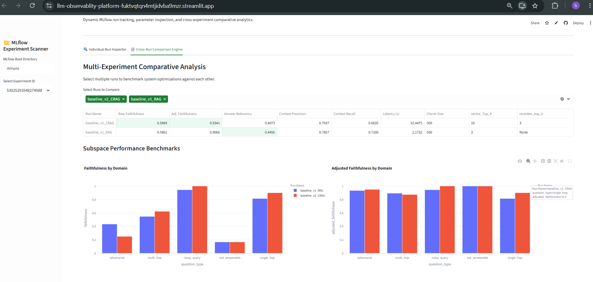

<div align="center">

# 🚀 Enterprise RAG Observability & Evaluation Platform

### Experiment Tracking • Hallucination Analysis • MLflow Monitoring • RAG Benchmarking


</div>

---

<p align="center">
  
</p>

---

# Overview

Retrieval-Augmented Generation (RAG) systems are typically evaluated only through manual testing or subjective inspection, making it difficult to understand why a configuration succeeds or fails.

This project focuses on **observability**. It provides an experimentation framework for benchmarking multiple RAG configurations, tracking evaluation metrics across runs, identifying hallucinations, and comparing retrieval strategies using a unified dashboard.

Each experiment is automatically evaluated using RAGAS, logged with MLflow, and visualized through an interactive Streamlit application, enabling systematic analysis instead of trial-and-error tuning.

The platform was designed to answer questions such as:

* Which retrieval configuration performs best?
* How much does CRAG improve response quality?
* Which prompts consistently hallucinate?
* Which retrieval parameters contribute to better factual grounding?
* How do retrieval changes affect latency and answer quality?

---

# Custom Metric — Adjusted Faithfulness

Traditional faithfulness metrics incorrectly penalize models that **refuse to answer** when the requested information does not exist inside the retrieved context.

For example,

> "I cannot determine the answer from the provided context."

is actually the desired behaviour, but RAGAS often assigns it a low faithfulness score because no factual claim is generated.

To distinguish genuine hallucinations from correct refusals, this project introduces **Adjusted Faithfulness**.

Let

* **F_raw** = Raw Faithfulness score from RAGAS
* **R** = Safe refusal response

Then

```text
               ⎧ 1.0      if response is a valid refusal
F_adjusted =   ⎨
               ⎩ F_raw    otherwise
```

This allows the evaluation framework to separate

* factual hallucinations
* retrieval failures
* correct guardrail behaviour

instead of treating all low-faithfulness responses equally.

---

# Features

### Multi-Configuration Benchmarking

The platform supports evaluation across multiple retrieval configurations including:

* Vanilla RAG
* CRAG (Corrective Retrieval-Augmented Generation)
* Different chunk sizes
* Different retrieval Top-K values


Each configuration is stored as an independent MLflow experiment for reproducible comparison.

---

### Automated Evaluation Pipeline

Every experiment is automatically evaluated on a curated benchmark dataset.

The evaluation pipeline computes

* Faithfulness
* Adjusted Faithfulness
* Answer Relevancy
* Context Precision
* Context Recall
* End-to-End Latency

All evaluation artifacts are preserved for later analysis.

---

### MLflow Experiment Tracking

Every experimental run records

* Hyperparameters
* Retrieval configuration
* Evaluation metrics
* Generated answers
* Complete evaluation CSV
* Run metadata

allowing every experiment to be reproduced and compared.

---

### Interactive Observability Dashboard

A Streamlit dashboard provides interactive inspection of all experiments.

Capabilities include

* Experiment leaderboard
* Run-to-run comparison
* Hyperparameter inspection
* Retrieval configuration tracking
* Hallucination audit logs
* Domain-wise benchmark visualization
* Performance comparison across configurations

---

### Hallucination Analysis

Instead of reporting only an aggregate score, the framework identifies individual responses responsible for poor performance.

Responses are categorized into

* Correct refusal
* Retrieval failure
* True hallucination

allowing rapid debugging of retrieval quality.

---

### Configuration Comparison

The platform enables side-by-side comparison between multiple retrieval strategies, making it possible to quantify improvements introduced by architectural changes such as CRAG.

Rather than relying on intuition, configuration decisions are supported by measurable evaluation metrics collected over identical benchmark datasets.


